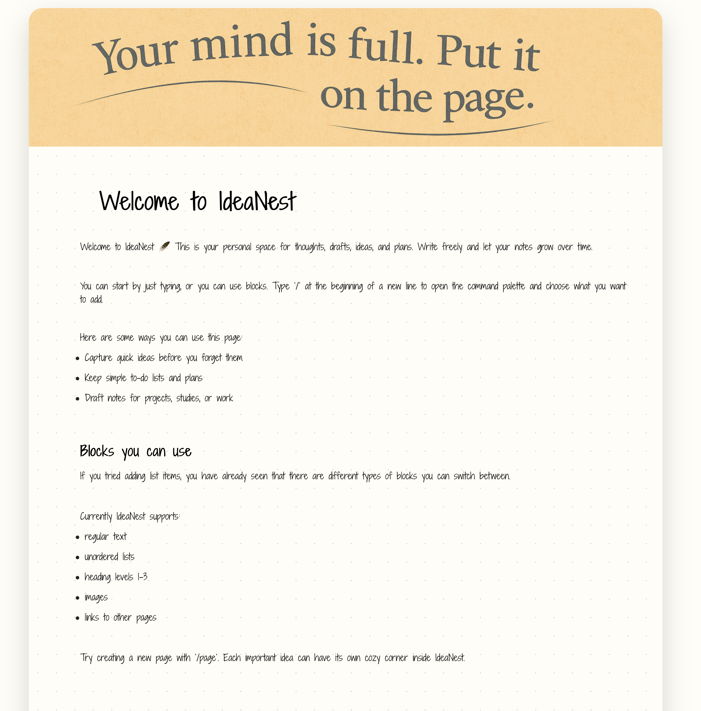

# IdeaNest

### ✨ Live Demo  
👉 **Try the app here:** [https://ideanest.netlify.app](https://jocular-zuccutto-517495.netlify.app)

---

**IdeaNest** is a minimalistic note-taking platform inspired by Notion, designed for fast idea capture, structured knowledge organization, and distraction-free writing.
It blends a handwritten aesthetic with a clean, modern interface to create a cozy, personal writing environment.

The application is built using **React + TypeScript** on the frontend and **Supabase** as the backend, providing authentication, storage, and real-time database updates.
Users can create pages, add content blocks, upload cover images, and organize their thoughts intuitively.


##  Uniqueness

IdeaNest distinguishes itself through its **paper-like interface with a warm, analog feel**, while still offering the flexibility of a digital editor.

Unlike typical note apps that feel corporate or sterile, IdeaNest’s goal is to:

- Make writing feel natural, inviting, and cozy
- Reduce friction for capturing spontaneous thoughts
- Provide a structure similar to Notion but with an artful, calming design
- Encourage creative flow rather than rigid documentation
 
It merges **digital productivity** with **handwritten personality**, creating a workspace that feels personal and enjoyable.


##  Features

### Content & Blocks
- Text blocks  
- Headings (H1–H3)  
- Unordered lists  
- Image blocks  
- Links to other pages  
- Drag & drop block reordering  
- Auto-save on every change  

### Page System
- Infinite nested pages  
- Custom cover image for each page  
- Clean back-navigation navigation  
- Per-user data isolation (no shared pages)

### Authentication
- Magic-link sign-in (Supabase Auth)  
- Secure session handling  
- Auto-redirect after login  

### UI / UX Highlights
- Paper-like dotted background  
- Handwritten-inspired typography  
- Soft shadows, rounded shapes  
- Modern floating logout button  
- Cozy and minimal writing environment

##  Screenshots

### Main UI Preview    
```md


